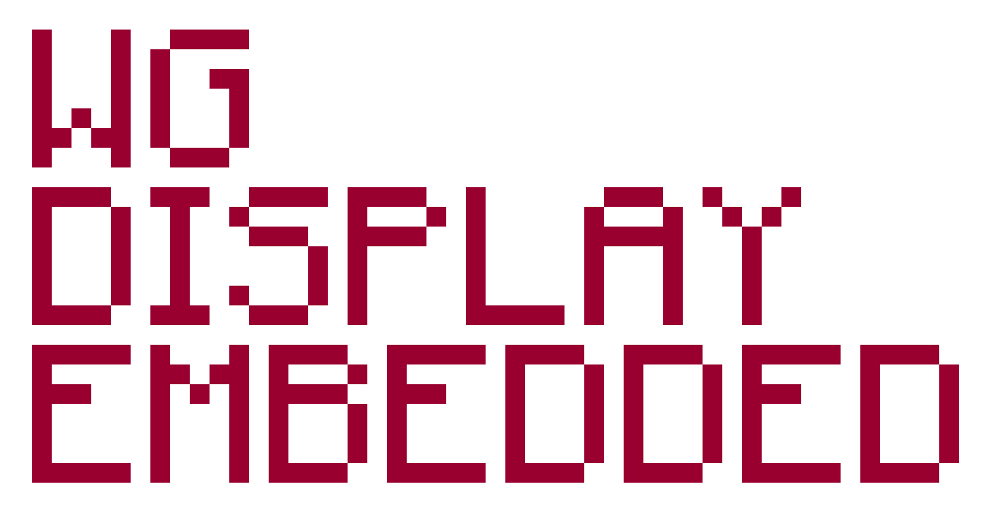

<p align="center">
	
</p>

<p align="center">
	<a href="https://github.com/Siryll/wg_display_embedded/actions/workflows/rust_ci.yml"></a>
	<a href="https://github.com/Siryll/wg_display_embedded/actions/workflows/pages.yml"></a>
	<a href="https://github.com/Siryll/wg_display_embedded/releases"></a>
	<a href="https://github.com/Siryll/wg_display_embedded/blob/main/LICENSE"></a>
</p>

<p align="center">
	A hackable information display for the ESP32-S3-Box-3, based on
	<a href="https://github.com/eliabieri/wg_display">wg_display</a>.
</p>

<p align="center">
	<a href="https://siryll.github.io/wg_display_embedded/"><strong>Installation Guide</strong></a>
</p>

## Differences to the Original

- Fully rebuilt backend in `no_std` Rust using [`esp-rs`](https://docs.espressif.com/projects/rust/) and [`embassy`](https://github.com/embassy-rs/embassy)
- Frontend fixes and optimizations
- Easy installation process using [`esp-web-tools`](https://github.com/esphome/esp-web-tools)
- New Widget Template

## Quick Start

If you just want to install and run the latest version on your ESP32-S3-Box-3,
follow the hosted setup guide. No toolchain installation required!

- [Install and setup instructions](https://siryll.github.io/wg_display_embedded/)

## Create your own Widget

Use the [Embedded Widget Template](https://github.com/Siryll/wg_display_embedded_widget_template) to create your own widget.
Complete with an automatic build pipeline to create the installable widget.

Check out these existing Widgets for inspiration:

- [`wg_display_embedded_widget_time`](https://github.com/Siryll/wg_display_embedded_widget_time)
- [`wg_display_embedded_widget_aareguru`](https://github.com/Siryll/wg_display_embedded_widget_aareguru)
- [`wg_display_embedded_widget_public_transport`](https://github.com/Siryll/wg_display_embedded_widget_public_transport)

## Build From Source

### Requirements

- [rustup](https://rustup.rs/)
- [espup](https://docs.espressif.com/projects/rust/book/getting-started/toolchain.html#xtensa-devices)
- [Node.js and npm](https://docs.npmjs.com/downloading-and-installing-node-js-and-npm)
- The [ESP32-S3-Box-3](https://github.com/espressif/esp-box/blob/master/docs/hardware_overview/esp32_s3_box_3/hardware_overview_for_box_3.md) development board

When using WSL, complete the required ESP packages first by following the [WSL instructions for ESP](https://docs.espressif.com/projects/vscode-esp-idf-extension/en/latest/additionalfeatures/wsl.html#adding-the-required-linux-packages-in-wsl).

### Toolchain Setup

For `picoserve`, use the 1.93.0 pre-release toolchain via `espup`:

```bash
espup install --toolchain-version 1.93.0
```

Install Trunk for the frontend build:

```bash
cargo install trunk
```

### Build And Run

```bash
git clone https://github.com/Siryll/wg_display_embedded.git
cd wg_display_embedded
make install-deps
make build
make run
```

Use larger font mode:

```bash
make run-large-font
```

After flashing, continue with the setup:

- [Post-flash setup guide](https://siryll.github.io/wg_display_embedded/)

## Screenshots

Project screenshots will appear here as they are added to the repository.

Suggested additions:

- Device photo running the dashboard
- Web setup or configuration page
- Widget gallery view

## Command Reference

```bash
make install-deps      # install project dependencies
make build             # build firmware + frontend
make run               # flash and run firmware
make run-large-font    # flash and run with larger font
```